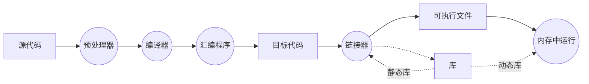

# Notes for compiling C/C++

可以下载展示 Slide 的 [keynote版](Notes_for_compiling_C_CXX.key) 或 [PDF版](Notes_for_compiling_C_CXX.pdf) 以在本地阅读。

> 以前的一些知识加上从网上搜许多资料，有问题敬请指出，请多担待。

## 编译器和解释器

### 一些概念

**编译器（****Complier****）**：源代码文件；编译，执行

例：C/CXX，Fortran

**解释器（****Interpreter****）**：源代码逐行；翻译，执行，翻译，执行，翻译，执行，翻译，执行 ……

例：python

**及一些其他的概念：**

JIT（Just-In-Time），REPL（Read–Eval–Print Loop）

例：Jupyter Notebook、Mathematica Notebook & Wolfram Language、Python、Julia、Numba（jit python numpy code）

IDE（Integrated Development Environment）：IDE通常包括编程语言编辑器、自动构建工具、通常还包括调试器，有的包括浏览器、对象查看器、对象结构图，有些IDE包含编译器／解释器，如微软的Microsoft Visual Studio。（维基百科）

例：vim(展示原本vim，展示配之后的vim和python代码编辑)，Visual Studio Code，Clion，Pycharm，Spyder……

## C/C++编译器

### 一些知识

GCC：GNU Complier Collection

GNU：GNU's Not Unix（GNU 是一个计划或者叫运动，最初是为了替代闭源Unix系统......）

...


通常所说的编译器由哪些部分组成，有哪些文件？流程图解释从源代码到运行的流程：





“虽然目标文件代码包含机器语言代码，但是不能直接运行。因为目标文件中存储的是编译器翻译的源代码，还不是一个完整的程序。目标文件缺失启动代码（startup code）。启动代码充当程序与操作系统之间的接口。目标代码还缺少库函数，几乎所有的 C 程序都要使用 C 标准库的函数。[*(来源暂不确定)*]()”


**C/C++一些常见的文件后缀：**

.out是可执行文件，相当于win上的exe； 

.o是编译中间目标代码文件，相当于win上的.obj； 

.a是静态库，多个.o练链接得到，用于静态链接，相当于win上的.lib； 

.so是共享库，用于动态链接，相当于win上.dll，mac上的.dylib 。

.h头文件是源代码的一部分编译时要用，.a是链接时需要的，.so是运行时需要的。

复习：流程图中对应，这些文件在哪里，有什么用。

一些细节：编译器和连接器如何知道依赖的文件有哪些，去哪里找，在哪里说明？详见实例。

**关于头文件**

使用头文件：#include … 相当于将 include 的头文件复制插入当前文件之前。

为什么不在头文件中写函数定义：多个文件 include 头文件会导致编译时函数重复定义报错。

为什么需要写有函数声明的头文件：C/C++ 函数在使用之前需要定义或者声明函数原型。

为什么需要在函数定义的c/cpp文件中include有自己声明的的头文件：非必要，但这样做可以让编译器检查定义和声明的一致性。

电脑怎样知道去哪里找这些定义的函数：当前文件有定义，则可以直接找到；别的文件中定义的，需要告诉链接器对应的目标代码文件的位置；静态库函数，需要告诉链接器静态库的位置；动态库函数，在运行时到默认路径下寻找，并拷贝到内存中某一地址共享使用。

**gcc** **的一些命令**
```shell
gcc -o [output filename] [filename] 
gcc -c [filename] # generate object file
gcc -I[include path] -L[library path] -l[library name]
gcc -fPIC -shared -o lib[libname].so [object filename] # 动态库
ar cr lib[libname].a sub.o add.o # archive -create/replace静态库
```


### 实例：编译运行源代码的过程。

 [*(参考)*](https://cloud.tencent.com/developer/article/1531843)

**一些代码文件：**
```
add.h : declaration add()

add.c : define add()

sub.h : declaration sub()

sub.c : define sub()

main.c : main(){add();sub();gsl_sf_bessel_J0();}
```

#### 最简单的过程

**需要做的事情：**

1. 编译 `add.c` `sub.c` 为目标代码: `gcc -c sub.c add.c`

2. 编译 `main.c` 为目标代码: `gcc -o main.o -c main.c`

3. 链接 `main.o` `add.o` `sub.o` 链接GSL的 gsl 和 gslcblas 库: `gcc -o main main.o add.o sub.o -lgsl -lgslcblas`

4. 运行得到的可执行文件: `./main`

#### 把 add.c sub.c 编译成静态库 mymath 再调用

**需要做的事情：**

1. 编译 `add.c` `sub.c` 为目标代码: `gcc -c sub.c add.c`

2. 整合 `add.o` `sub.o` 为静态库文件 `libmymath.a`:  `ar cr libmymath.a sub.o add.o`

3. 编译 `main.c` 为目标代码:  `gcc -o main.o -c main.c`

4. link `main.o` 和库文件（或指定link路径并link库名）link GSL的 gsl 和 gslcblas 库: `gcc -o main main.o libmymath.a -lgsl -lgslcblas` 或 `gcc -o main main.c -L. -lmymath -lgsl -lgslcblas`

5. 运行得到的可执行文件: `./main`

#### 把 add.c sub.c 编译成动态库 mymath 再调用

**需要做的事情：**

1. 编译 `add.c` `sub.c` 为目标代码: `gcc -c sub.c add.c`

2. 链接 `add.o` `sub.o` 为动态库文件 `libmymath.so`: `gcc -fPIC -shared -o  libmymath.so add.o sub.o`

3. 编译 `main.c` 为目标代码: `gcc -o main.o -c main.c`

4. link `main.o` 和库文件（或指定link路径并link库名） link GSL的 gsl 和 gslcblas 库: `gcc -o main main.o libmymath.so -lgsl -lgslcblas` 或 `gcc -o main main.o -L. -lmymath -lgsl -lgslcblas`

5. 运行得到的可执行文件: `./main`

## 把编译过程和依赖文件写成文件：make

 [*(参考)*](https://seisman.github.io/how-to-write-makefile/introduction.html)

使用默认的 makefile/Makefile 命令：`make` # 默认使用makefile/Makefile

指定makefile命令：`make -f [MakefileName]`

makefile最基本语法规则：
```makefile
target ... : prerequisites ...
   command
```

make 具有文件依赖推理功能，在运行make命令时，自动检查依赖源文件是否有更新，自动重新编译依赖项目。make功能强大复杂，多个makefile相互include，依赖推理带来的高级用法请自行探索（比如省略一些命令）。可以参考[GNU make manual](https://www.gnu.org/software/make/manual/make.html)，注意，显然 GNU make 并不是只能搭配GCC编译器，同样适用于其他的编译器。

```makefile
CC = gcc
CFLAGS := $(gsl-config --cflags)
LDLIBS := -lgsl -lgslcblas # $(echo $(gsl-config --libs)) 

main: main.o libmymath.a
  $(CC) -o main $(LDLIBS) main.o libmymath.a  
	@# -L. -lmymath
   # Makefile 1.0

add.o: add.c add.h
	$(CC) -c add.c
	
sub.o: sub.c sub.h
	$(CC) -c sub.c
	
libmymath.a: add.o sub.o
	ar cr libmymath.a add.o sub.o
	
main.o: main.c add.h sub.h
	$(CC) -c main.c
	
obj = main.o add.o sub.o

.PHONY: cleanall cleanobj
cleanobj:
	rm $(obj)
cleanall:
	rm main $(obj) libmymath.a
```

## **跨平台**生成对应平台能用的makefile：CMake

通过自行编辑的 CMakeLists.txt 中的内容，CMake可以自动生成适用当前平台的makefile，构建一个可执行文件。**Clion: A cross-platform IDE for C and C++** 当中默认使用CMake，作简要展示。

通过自行编辑的 CMakeLists.txt 中的内容，CMake可以自动生成适用当前平台的Makefile，构建一个可执行文件。**Clion: A cross-platform IDE for C and C++** 当中默认使用CMake，作简要展示。


## 注

这个Note已经放在Github上，你可以在这里( [github.com/feizhanxia/useCXXLibs](https://github.com/feizhanxia/useCXXLibs) )找到这个Slide以及展示中用到的全部文件。

