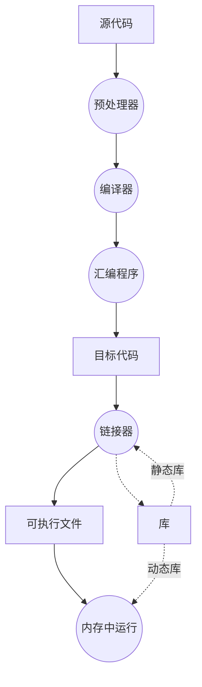

# Notes for compiling C/C++

> 以前的一些知识加上从网上搜许多资料，有问题敬请指出，请多担待。

## 编译器和解释器

编译器（Complier）：源代码文件；编译，执行
例：C/CXX，Fortran

解释器（Interpreter）：源代码逐行；翻译，执行，翻译，执行
例：python

JIT（Just-In-Time），REPL（Read–Eval–Print Loop）
Jupyter Notebook、Mathematica Notebook & Wolfram Language、Python、Julia、Numba（jit python numpy code）

## C/C++编译器

GCC：GNU Complier Collection

GNU：GNU's Not Unix（GNU 是一个计划或者叫运动，最初是为了替代闭源Unix系统......）

...

...

通常所说的编译器由哪些部分组成，有哪些文件？流程图解释从源代码到运行的流程：

“虽然目标文件代码包含机器语言代码，但是不能直接运行。因为目标文件中存储的是编译器翻译的源代码，还不是一个完整的程序。目标文件缺失启动代码（startup code）。启动代码充当程序与操作系统之间的接口。目标代码还缺少库函数，几乎所有的 C 程序都要使用 C 标准库的函数。[*(来源暂不确定)*]()”

**C/C++一些常见的文件后缀：**

.out是可执行文件，相当于win上的exe； 

.o是编译中间目标代码文件，相当于win上的.obj； 

.a是静态库，多个.o练链接得到，用于静态链接，相当于win上的.lib； 

.so是共享库，用于动态链接，相当于win上.dll，mac上的.dylib 。

.h头文件是源代码的一部分编译时要用，.a是链接时需要的，.so是运行时需要的。

复习：流程图中对应，这些文件在哪里，有什么用。

一些细节：编译器和连接器如何知道依赖的文件有哪些，去哪里找，在哪里说明？详见实例。

**实例：编译运行源代码的过程。** [*(参考)*](https://cloud.tencent.com/developer/article/1531843)

## 把编译过程和依赖文件写成文件：make

默认makefile：makefile/Makefile

指定makefile：makefile -f [MakefileName]

make 具有文件依赖推理功能，在运行make命令时，自动检查依赖源文件是否有更新，自动重新编译依赖项目。make功能强大复杂，多个makefile相互include，依赖推理带来的高级用法请自行探索（比如省略一些命令）。可以参考[https://www.gnu.org/software/make/manual/make.html](https://www.gnu.org/software/make/manual/make.html)，注意，显然 GNU make 并不是只能搭配GCC编译器，同样适用于其他的编译器。

## **跨平台**生成对应平台能用的makefile：cmake

通过自行编辑的 CMakeLists.txt 中的内容，cmake可以自动生成适用当前平台的makefile，构建一个可执行文件。**Clion: A cross-platform IDE for C and C++** 当中默认使用CMake，作简要展示。

## 附关于编译器
